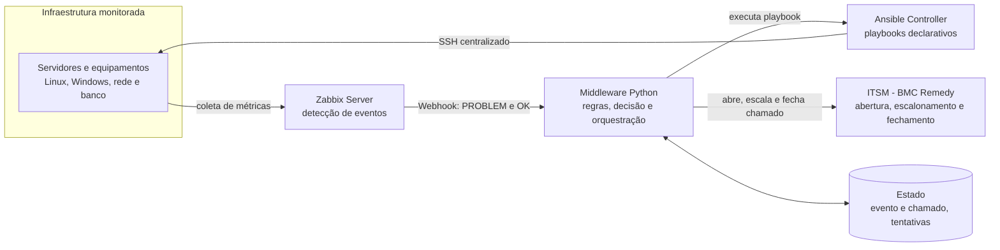
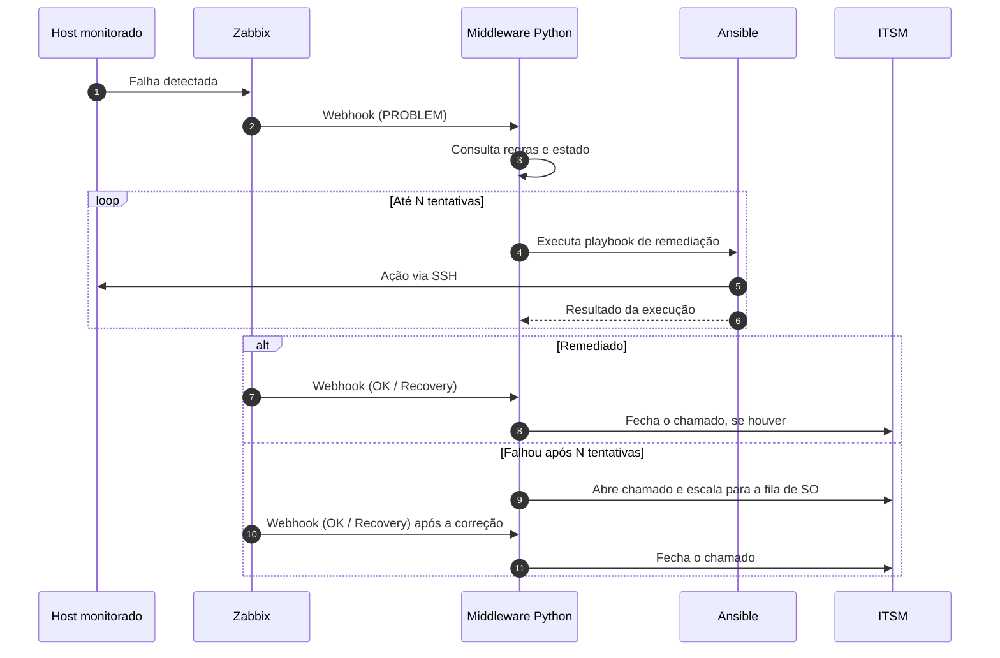

## Arquitetura e Justificativa Tecnológica

Para o ciclo de vida de auto-remediação e orquestração de incidentes, adotamos a arquitetura **Zabbix → Webhook → Middleware (Python) → Ansible / ITSM**.

### Motivos para a Escolha da Arquitetura

1. **Separação de Responsabilidades:** O Zabbix atua estritamente na detecção de eventos e envio de dados via Webhook. A decisão de negócio e orquestração do incidente fica centralizada no Middleware Python.
2. **Segurança e Privilégios:** Elimina-se a necessidade de permissões de execução remota (`sudo`) diretamente nos agentes Zabbix dos servidores. Toda a comunicação de remediação ocorre via SSH centralizado pela controladora do Ansible.
3. **Gerenciamento de Ciclo de Vida do Incidente:** A arquitetura permite integrar facilmente o fluxo com plataformas de ITSM (abertura, escalonamento para fila de SO após $N$ tentativas e fechamento automático após a verificação do Zabbix).
4. **Idempotência e Manutenibilidade:** A remediação é feita através de Playbooks Ansible declarativas, garantindo que as ações executadas sejam seguras, idênticas e auditáveis.

## Visão da Arquitetura

## Ciclo de Vida do Incidente

