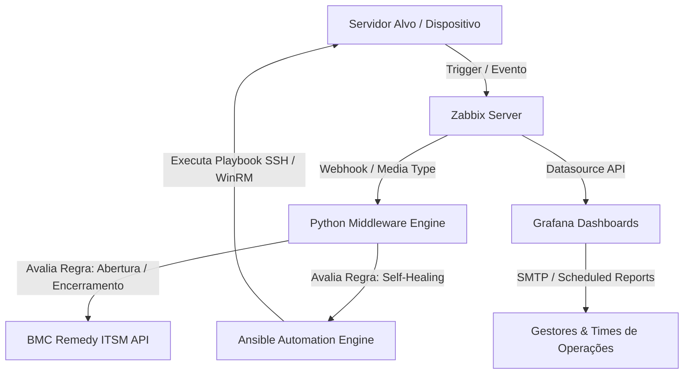

# 🚀 Zabbix Event-Driven Automation & Observability Pipeline

[](https://github.com/)
[](https://www.zabbix.com/)
[](https://www.ansible.com/)
[](https://www.python.org/)
[](https://grafana.com/)
[](https://www.docker.com/)

---

## 📌 Visão Geral

Este repositório contém um ecossistema completo de **Automação Guiada por Eventos (Event-Driven Automation)** e **Observabilidade**, integrando o **Zabbix**, **Ansible**, **Python**, **Grafana** e a plataforma de ITSM (**BMC Remedy**).

O objetivo principal da arquitetura é reduzir drasticamente o **MTTR (Mean Time to Repair)** e eliminar tarefas operacionais manuais através de **Self-Healing (Auto-remediação)**, roteamento inteligente de chamados e relatórios analíticos de infraestrutura.

---

## 🏗️ Arquitetura da Solução



---

## ⚡ Principais Funcionalidades

### 1. 🔄 Auto-Remediação (Self-Healing)
* **Ação:** Identificação automática de falhas em serviços críticos (ex: Web Servers, Bancos de Dados, Spooler).
* **Execução:** Disparo de playbooks Ansible que realizam diagnósticos, reiniciam serviços ou limpam temporary files sem intervenção humana.
* **Validação:** Checagem pós-execução e encerramento automático do evento no Zabbix.

### 2. 🎫 Roteamento Inteligente de Chamados (ITSM / BMC Remedy)
* **Triagem Automática:** Enriquecimento dos dados do evento Zabbix e direcionamento automático para a fila responsável (ex: *Fila SO*, *Fila Banco de Dados*, *Fila NOC*).
* **Ações Externas:** Notificação automática via e-mail para fornecedores/ISPs em caso de queda de links de conectividade.
* **Ciclo de Vida do Incidente:** Atualização do status e encerramento automático do chamado assim que a condição de *OK / Recovery* é confirmada pelo Zabbix.

### 3. 📊 Observabilidade Analítica e Relatórios
* **Dashboards no Grafana:** Mapeamento de *Top Hosts com mais incidentes*, identificação de *Flapping* (oscilações) e análise de MTTR.
* **Relatórios Automatizados:** Envio de relatórios consolidados por e-mail (PDF/HTML) para equipes executivas e operacionais.

---

## 📂 Estrutura do Repositório

```text
.
├── ansible/               # Playbooks e inventários para auto-remediação
│   ├── inventory/         # Arquivos de hosts e variáveis
│   └── playbooks/         # Playbooks de restart e manutenção
├── docker/                # Dockerfiles e docker-compose para ambiente local
├── integrations/          # Middleware em Python (Zabbix <-> Remedy API)
│   ├── scripts/           # Script principal e manipuladores do Webhook
│   └── utils/             # Módulos auxiliares e formatadores de payload
├── grafana/               # Dashboards em JSON e configurações do datasource
│   └── dashboards/
├── docs/                  # Diagramas e documentação da API
├── .env.example           # Modelo de variáveis de ambiente
├── .gitignore             # Arquivos ignorados pelo Git
├── requirements.txt       # Dependências Python
└── README.md              # Documentação principal
```

---

## 🚀 Como Executar o Projeto

### Pré-requisitos
* Python 3.10+
* Docker e Docker Compose
* Ansible Core 2.12+

### 1. Clonar o repositório
```bash
git clone https://github.com/SEU_USUARIO/zabbix-devops-automation.git
cd zabbix-devops-automation
```

### 2. Configurar o Ambiente Virtual Python & Dependências
```bash
python3 -m venv .venv
source .venv/bin/activate  # No Windows: .venv\Scripts\activate
pip install -r requirements.txt
```

### 3. Configurar Variáveis de Ambiente
Crie o arquivo `.env` baseado no modelo disponibilizado:
```bash
cp .env.example .env
```
*Edite o arquivo `.env` inserindo as URLs do Zabbix, tokens da API e credenciais de acesso ao BMC Remedy.*

---

## 🧰 Tecnologias e Ferramentas

* **Monitoramento:** Zabbix 6.0/7.0 LTS
* **Automação & Configuração:** Ansible, Python 3
* **Observabilidade:** Grafana
* **Containerização:** Docker & Docker Compose
* **ITSM:** BMC Remedy REST API
* **Versionamento:** Git / GitHub

---

## 👤 Autor

Desenvolvido por **Fernando Silva**
