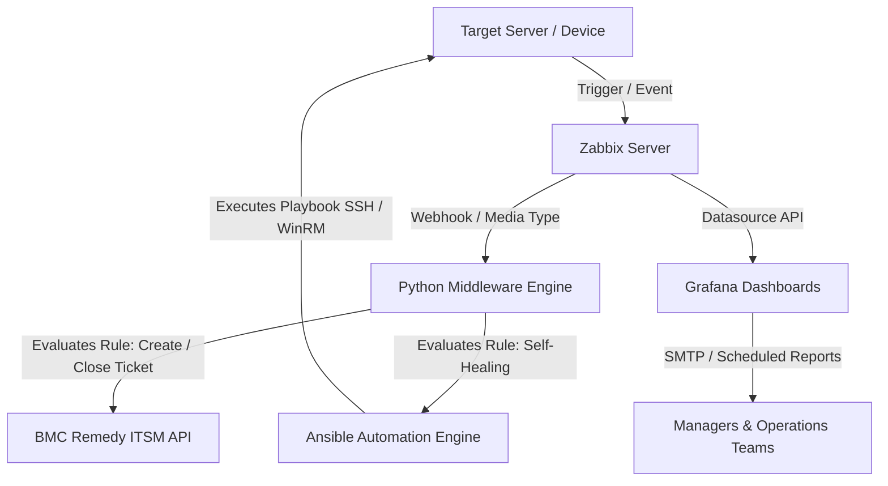

# 🚀 Zabbix Event-Driven Automation & Observability Pipeline

[](https://github.com/)
[](https://www.zabbix.com/)
[](https://www.ansible.com/)
[](https://www.python.org/)
[](https://grafana.com/)
[](https://www.docker.com/)

---

## 📌 Overview

This repository contains an **Event-Driven Automation** and **Observability** pipeline integrating **Zabbix**, **Ansible**, **Python**, **Grafana**, and an ITSM platform (**BMC Remedy**).

The core objective of this architecture is to significantly reduce **MTTR (Mean Time to Repair)** and eliminate repetitive operational tasks through **Self-Healing**, intelligent ticket routing, and analytical infrastructure reports.

---

## 🏗️ Solution Architecture



---

## ⚡ Key Features

### 1. 🔄 Self-Healing Automation
* **Trigger:** Automatic identification of critical service failures (e.g., Web Servers, Databases, Print Spooler).
* **Execution:** Triggers Ansible playbooks to run diagnostics and restart failed services without human intervention.
* **Validation:** Post-execution verification and automatic event recovery in Zabbix.

### 2. 🎫 Intelligent Ticket Routing (BMC Remedy ITSM)
* **Automated Triage:** Enriches Zabbix event payloads and routes tickets automatically to the responsible assignment group (e.g., *OS Team*, *DBA Team*, *NOC Team*).
* **External Actions:** Sends automated notification emails to third-party providers/ISPs during network link outages.
* **Lifecycle Management:** Updates ticket logs and automatically closes tickets upon receiving an *OK / Recovery* event from Zabbix.

### 3. 📊 Analytical Observability & Reporting
* **Grafana Dashboards:** Tracks *Top Incident Hosts*, detects *Flapping* alerts, and measures MTTR metrics.
* **Scheduled Reports:** Automated email dispatch of PDF/HTML executive reports for management and operations teams.

---

## 📂 Repository Structure

```text
.
├── ansible/               # Ansible playbooks and inventories for self-healing
│   ├── inventory/         # Hosts files and group variables
│   └── playbooks/         # Service restart and maintenance playbooks
├── docker/                # Dockerfiles and docker-compose for local setup
├── integrations/          # Python Middleware (Zabbix <-> Remedy API)
│   ├── scripts/           # Main webhook handler scripts
│   └── utils/             # Payload formatters and helper modules
├── grafana/               # Exported JSON dashboards and datasources
│   └── dashboards/
├── docs/                  # Architecture diagrams and API documentation
├── .env.example           # Environment variables template
├── .gitignore             # Git ignore rules
├── requirements.txt       # Python dependencies
└── README.md              # Main documentation
```

---

## 🚀 Quick Start

### Prerequisites
* Python 3.10+
* Docker and Docker Compose
* Ansible Core 2.12+

### 1. Clone the repository
```bash
git clone https://github.com/YOUR_USERNAME/zabbix-devops-automation.git
cd zabbix-devops-automation
```

### 2. Setup Python Virtual Environment
```bash
python3 -m venv .venv
source .venv/bin/activate  # On Windows: .venv\Scripts\activate
pip install -r requirements.txt
```

### 3. Configure Environment Variables
Create a `.env` file based on the provided template:
```bash
cp .env.example .env
```
*Edit the `.env` file with your Zabbix API credentials, tokens, and BMC Remedy endpoint details.*

---

## 🧰 Tech Stack

* **Monitoring:** Zabbix 6.0/7.0 LTS
* **Automation & Configuration:** Ansible, Python 3
* **Observability:** Grafana
* **Containerization:** Docker & Docker Compose
* **ITSM Integration:** BMC Remedy REST API
* **Version Control:** Git / GitHub

---

## 👤 Author

Developed by **Fernando Silva**
